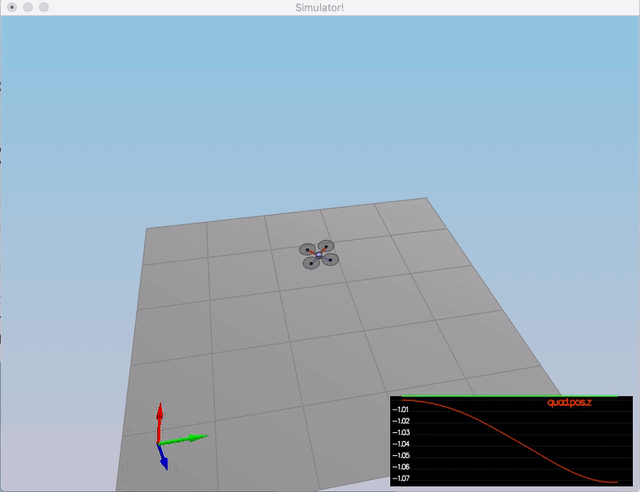
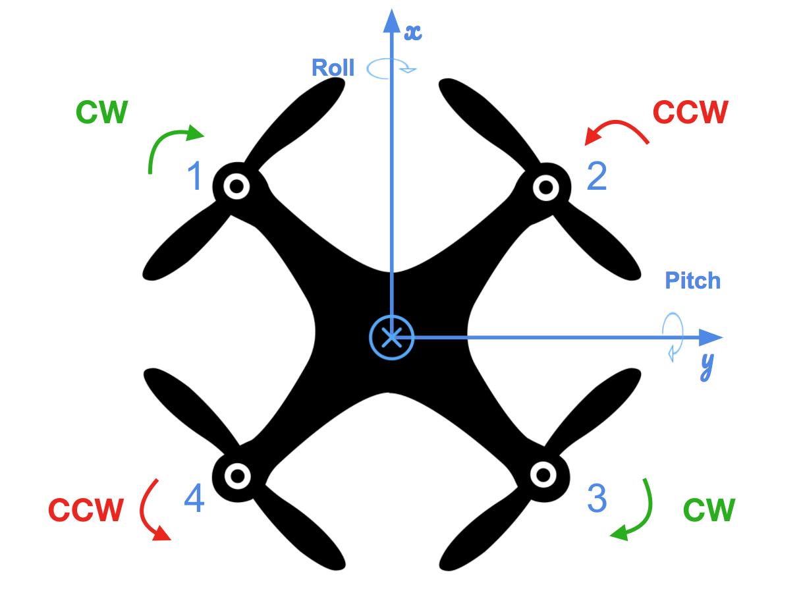
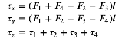
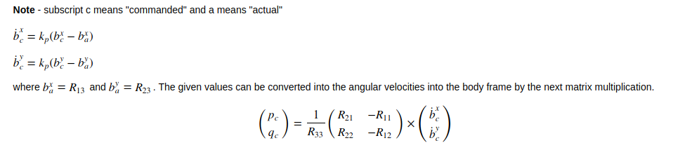
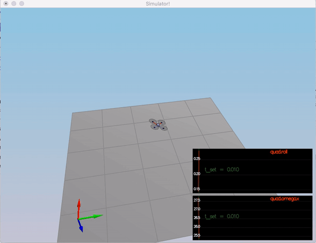
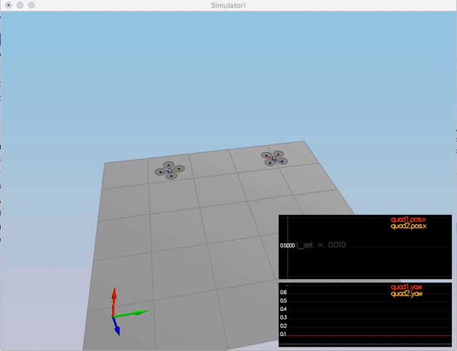
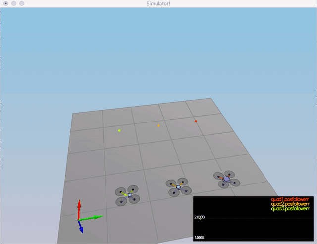

# Control of a 3D Quadrotor#


For this project, you will write the low level flight controllers for the vehicle. In this project, commands will be passed as three directional body moments and thrust. Using the position, velocity, attitude, and body rates sent from the simulation, you'll expand these capabilities to follow a timed trajectory. The theory behind the controller design using feed-forward strategy is explained in details on our instructor, Angela P. Schoellig, on her paper [Feed-Forward Parameter Identification for Precise Periodic Quadrocopter Motions](http://www.dynsyslab.org/wp-content/papercite-data/pdf/schoellig-acc12.pdf). The following diagram could be found on that paper describing the cascaded control loops of the trajectory-following controller:


[Detailed Project Explantion Page](https://github.com/udacity/FCND-Controls)


## C++ implementation

All the C++ code is in the /src directory. The more interesting files are:

/config/QuadControlParams.txt: This file contains the configuration for the controller. While the simulator is running, you can modify this file, and the simulator will "refresh" those parameters on the next loop execution.

/src/QuadControl.cpp: This is where all the fun is, but I should not say this because this file contains the implementation of the controller only. Most of the time needed to pass the scenarios is spend on the parameter tuning.


### Senario 1 : Intro

In this senario , the mass of quadrotor is adjusted to make the quad more or less stay in the same spot.

With the proper mass = 0.5.

<p align="center">

</p>

Performance Evaluation:

Result:
```
PASS: ABS(Quad.PosFollowErr) was less than 0.500000 for at least 0.800000 seconds
```


### Scenario 2: Body rate and roll/pitch control  ###


First, you will implement the body rate and roll / pitch control.  For the simulation, you will use `Scenario 2`.  In this scenario, you will see a quad above the origin.  It is created with a small initial rotation speed about its roll axis.  Your controller will need to stabilize the rotational motion and bring the vehicle back to level attitude.

To accomplish this, you will:

1. Implement body rate control

 - implement the code in the function `GenerateMotorCommands()`

 




```
VehicleCommand QuadControl::GenerateMotorCommands(float collThrustCmd, V3F momentCmd)
{
  // Convert a desired 3-axis moment and collective thrust command to 
  //   individual motor thrust commands
  // INPUTS: 
  //   collThrustCmd: desired collective thrust [N]
  //   momentCmd: desired rotation moment about each axis [N m]
  // OUTPUT:
  //   set class member variable cmd (class variable for graphing) where
  //   cmd.desiredThrustsN[0..3]: motor commands, in [N]

  // HINTS: 
  // - you can access parts of momentCmd via e.g. momentCmd.x
  // You'll need the arm length parameter L, and the drag/thrust ratio kappa

  ////////////////////////////// BEGIN STUDENT CODE ///////////////////////////

  float l = L / sqrtf(2.f);
  float t_x = momentCmd.x / l;
  float t_y = momentCmd.y / l;
  float t_z = -momentCmd.z / kappa;
  float F = collThrustCmd;
  
  float N0 = (F + t_z + t_x + t_y) / 4.f; // front left
  float N1 = (F - t_z - t_x + t_y) / 4.f; // front right
  float N2 = (F - t_z + t_x - t_y) / 4.f; // rear left
  float N3 = (F + t_z - t_x - t_y) / 4.f; // rear right
  
  cmd.desiredThrustsN[0] = CONSTRAIN(N0, minMotorThrust, maxMotorThrust); // front left
  cmd.desiredThrustsN[1] = CONSTRAIN(N1, minMotorThrust, maxMotorThrust); // front right
  cmd.desiredThrustsN[2] = CONSTRAIN(N2, minMotorThrust, maxMotorThrust); // rear left
  cmd.desiredThrustsN[3] = CONSTRAIN(N3, minMotorThrust, maxMotorThrust); // rear right
  /////////////////////////////// END STUDENT CODE ////////////////////////////

  return cmd;
}
```


 - implement the code in the function `BodyRateControl()`
 The commanded roll, pitch, and yaw are collected by the body rate controller, and they are translated into the desired moment along the axis in the body frame. This control method use only P controller.

```
V3F QuadControl::BodyRateControl(V3F pqrCmd, V3F pqr)
{
  // Calculate a desired 3-axis moment given a desired and current body rate
  // INPUTS: 
  //   pqrCmd: desired body rates [rad/s]
  //   pqr: current or estimated body rates [rad/s]
  // OUTPUT:
  //   return a V3F containing the desired moments for each of the 3 axes

  // HINTS: 
  //  - you can use V3Fs just like scalars: V3F a(1,1,1), b(2,3,4), c; c=a-b;
  //  - you'll need parameters for moments of inertia Ixx, Iyy, Izz
  //  - you'll also need the gain parameter kpPQR (it's a V3F)

  V3F momentCmd;

  ////////////////////////////// BEGIN STUDENT CODE ///////////////////////////
  V3F rateError = pqrCmd - pqr;
  
  V3F I;
  I.x = Ixx;
  I.y = Iyy;
  I.z = Izz;

  momentCmd = I * kpPQR * rateError;

  /////////////////////////////// END STUDENT CODE ////////////////////////////

  return momentCmd;
}
```


 - Tune `kpPQR` in `QuadControlParams.txt` to get the vehicle to stop spinning quickly but not overshoot


2. Implement roll / pitch control
We won't be worrying about yaw just yet.

 - implement the code in the function `RollPitchControl()`

The roll-pitch controller is a P controller responsible for commanding the roll and pitch rates ( 𝑝𝑐  and  𝑞𝑐 ) in the body frame. First, it sets the desired rate of change of the given matrix elements using a P controller.



```
V3F QuadControl::RollPitchControl(V3F accelCmd, Quaternion<float> attitude, float collThrustCmd)
{
  // Calculate a desired pitch and roll angle rates based on a desired global
  //   lateral acceleration, the current attitude of the quad, and desired
  //   collective thrust command
  // INPUTS: 
  //   accelCmd: desired acceleration in global XY coordinates [m/s2]
  //   attitude: current or estimated attitude of the vehicle
  //   collThrustCmd: desired collective thrust of the quad [N]
  // OUTPUT:
  //   return a V3F containing the desired pitch and roll rates. The Z
  //     element of the V3F should be left at its default value (0)

  // HINTS: 
  //  - we already provide rotation matrix R: to get element R[1,2] (python) use R(1,2) (C++)
  //  - you'll need the roll/pitch gain kpBank
  //  - collThrustCmd is a force in Newtons! You'll likely want to convert it to acceleration first

  V3F pqrCmd;
  Mat3x3F R = attitude.RotationMatrix_IwrtB();

  ////////////////////////////// BEGIN STUDENT CODE ///////////////////////////
  if (collThrustCmd > 0) {
    
    float c = -collThrustCmd/mass;
  
    float R11 = R(0,0);
    float R12 = R(0,1);
    float R21 = R(1,0);
    float R22 = R(1,1);
    float R33 = R(2,2);
  
    float b_x_actual = R(0,2);
    float b_y_actual = R(1,2);
  
    float b_x_c = CONSTRAIN(accelCmd.x / c, -maxTiltAngle, maxTiltAngle);
    float b_dot_x_c = kpBank * (b_x_c - b_x_actual);
  
    float b_y_c = CONSTRAIN(accelCmd.y / c, -maxTiltAngle, maxTiltAngle);
    float b_dot_y_c = kpBank * (b_y_c - b_y_actual);
  
    float p_c = (1 / R33) * (R21 * b_dot_x_c - R11 * b_dot_y_c);
    float q_c = (1 / R33) * (R22 * b_dot_x_c - R12 * b_dot_y_c);
  
    pqrCmd.x = p_c;
    pqrCmd.y = q_c;
  }
  else {
    pqrCmd.x = 0;
    pqrCmd.y = 0;
  }
```

 - Tune `kpBank` in `QuadControlParams.txt` to minimize settling time but avoid too much overshoot

If successful you should now see the quad level itself (as shown below), though it’ll still be flying away slowly since we’re not controlling velocity/position!  You should also see the vehicle angle (Roll) get controlled to 0.

<p align="center">

</p>

Performance Evaluation:

Result:
```
PASS: ABS(Quad.Omega.X) was less than 2.500000 for at least 0.750000 seconds
```

### Scenario 3: Position/velocity and yaw angle control  ###

Next, you will implement the position, altitude and yaw control for your quad.  For the simulation, you will use `Scenario 3`.  This will create 2 identical quads, one offset from its target point (but initialized with yaw = 0) and second offset from target point but yaw = 45 degrees.

 - implement the code in the function `LateralPositionControl()`
 
 The rotation matrix elements R13 (also referred to as b_x ) and R23 (also referred to as b_y ). Lateral acceleration commend comes from lateral controller. By using it, b_x_target & b_y_target are obtained.


```
V3F QuadControl::LateralPositionControl(V3F posCmd, V3F velCmd, V3F pos, V3F vel, V3F accelCmdFF)
{
  // Calculate a desired horizontal acceleration based on 
  //  desired lateral position/velocity/acceleration and current pose
  // INPUTS: 
  //   posCmd: desired position, in NED [m]
  //   velCmd: desired velocity, in NED [m/s]
  //   pos: current position, NED [m]
  //   vel: current velocity, NED [m/s]
  //   accelCmdFF: feed-forward acceleration, NED [m/s2]
  // OUTPUT:
  //   return a V3F with desired horizontal accelerations. 
  //     the Z component should be 0
  // HINTS: 
  //  - use the gain parameters kpPosXY and kpVelXY
  //  - make sure you limit the maximum horizontal velocity and acceleration
  //    to maxSpeedXY and maxAccelXY

  // make sure we don't have any incoming z-component
  accelCmdFF.z = 0;
  velCmd.z = 0;
  posCmd.z = pos.z;

  // we initialize the returned desired acceleration to the feed-forward value.
  // Make sure to _add_, not simply replace, the result of your controller
  // to this variable
  V3F accelCmd = accelCmdFF;

  ////////////////////////////// BEGIN STUDENT CODE ///////////////////////////
  V3F pos_err = posCmd - pos ;

  if (velCmd.mag() > maxSpeedXY) {
    velCmd = velCmd.norm() * maxSpeedXY;
  }
   
  V3F vel_err = velCmd - vel ;

  accelCmd = kpPosXY * pos_err + kpVelXY * vel_err + accelCmd ;

  if (accelCmd.mag() > maxAccelXY) {
    accelCmd = accelCmd.norm() * maxAccelXY;
  }

  accelCmd.z = 0;
  /////////////////////////////// END STUDENT CODE ////////////////////////////

  return accelCmd;
}
```
 - implement the code in the function `AltitudeControl()`
 

```
float QuadControl::AltitudeControl(float posZCmd, float velZCmd, float posZ, float velZ, Quaternion<float> attitude, float accelZCmd, float dt)
{
  // Calculate desired quad thrust based on altitude setpoint, actual altitude,
  //   vertical velocity setpoint, actual vertical velocity, and a vertical 
  //   acceleration feed-forward command
  // INPUTS: 
  //   posZCmd, velZCmd: desired vertical position and velocity in NED [m]
  //   posZ, velZ: current vertical position and velocity in NED [m]
  //   accelZCmd: feed-forward vertical acceleration in NED [m/s2]
  //   dt: the time step of the measurements [seconds]
  // OUTPUT:
  //   return a collective thrust command in [N]

  // HINTS: 
  //  - we already provide rotation matrix R: to get element R[1,2] (python) use R(1,2) (C++)
  //  - you'll need the gain parameters kpPosZ and kpVelZ
  //  - maxAscentRate and maxDescentRate are maximum vertical speeds. Note they're both >=0!
  //  - make sure to return a force, not an acceleration
  //  - remember that for an upright quad in NED, thrust should be HIGHER if the desired Z acceleration is LOWER

  Mat3x3F R = attitude.RotationMatrix_IwrtB();
  float thrust = 0;

  ////////////////////////////// BEGIN STUDENT CODE ///////////////////////////
    
  float b_z = R(2,2);

  float z_error = posZCmd - posZ;
  float z_dot_error = velZCmd - velZ;
  integratedAltitudeError += z_error * dt;
  
  float p_term = kpPosZ * z_error + velZCmd;
  float i_term = KiPosZ * integratedAltitudeError;
  float d_term = kpVelZ * z_dot_error;
  
  float u_bar_1 = p_term + i_term + d_term + accelZCmd;
  
  float acceleration = (u_bar_1 - CONST_GRAVITY) / b_z;
  
  thrust = -mass * CONSTRAIN(acceleration, -maxAscentRate / dt, maxDescentRate / dt);

  /////////////////////////////// END STUDENT CODE ////////////////////////////
  
  return thrust;
}
```

 - tune parameters `kpPosZ` and `kpPosZ`
 - tune parameters `kpVelXY` and `kpVelZ`

If successful, the quads should be going to their destination points and tracking error should be going down (as shown below). However, one quad remains rotated in yaw.

 - implement the code in the function `YawControl()`
  

```
float QuadControl::YawControl(float yawCmd, float yaw)
{
  // Calculate a desired yaw rate to control yaw to yawCmd
  // INPUTS: 
  //   yawCmd: commanded yaw [rad]
  //   yaw: current yaw [rad]
  // OUTPUT:
  //   return a desired yaw rate [rad/s]
  // HINTS: 
  //  - use fmodf(foo,b) to unwrap a radian angle measure float foo to range [0,b]. 
  //  - use the yaw control gain parameter kpYaw

  float yawRateCmd=0;
  ////////////////////////////// BEGIN STUDENT CODE ///////////////////////////
  if (yawCmd > 0) {
     yawCmd = fmodf(yawCmd, 2.f * F_PI);
   } else {
     yawCmd = fmodf(yawCmd, -2.f * F_PI);
   }

  float yaw_err = yawCmd - yaw ;
  
   if ( yaw_err > F_PI ) {
     yaw_err = yaw_err - 2.f * F_PI;
   }
   if ( yaw_err < -F_PI ) {
     yaw_err = yaw_err + 2.f * F_PI;
   }

   yawRateCmd = kpYaw * yaw_err;
  /////////////////////////////// END STUDENT CODE ////////////////////////////

  return yawRateCmd;

}
```

 - tune parameters `kpYaw` and the 3rd (z) component of `kpPQR`

Tune position control for settling time. Don’t try to tune yaw control too tightly, as yaw control requires a lot of control authority from a quadcopter and can really affect other degrees of freedom.  This is why you often see quadcopters with tilted motors, better yaw authority!

<p align="center">

</p>

**Hint:**  For a second order system, such as the one for this quadcopter, the velocity gain (`kpVelXY` and `kpVelZ`) should be at least ~3-4 times greater than the respective position gain (`kpPosXY` and `kpPosZ`).

Performance Evaluation:

Result:
```
PASS: ABS(Quad1.Pos.X) was less than 0.100000 for at least 1.250000 seconds
PASS: ABS(Quad2.Pos.X) was less than 0.100000 for at least 1.250000 seconds
PASS: ABS(Quad2.Yaw) was less than 0.100000 for at least 1.000000 seconds
```

### Non-idealities and robustness (scenario 4) ###

In this part, we will explore some of the non-idealities and robustness of a controller.  For this simulation, we will use `Scenario 4`.  This is a configuration with 3 quads that are all are trying to move one meter forward.  However, this time, these quads are all a bit different:
 - The green quad has its center of mass shifted back
 - The orange vehicle is an ideal quad
 - The red vehicle is heavier than usual

1. Run your controller & parameter set from Step 3.  Do all the quads seem to be moving OK?  If not, try to tweak the controller parameters to work for all 3 (tip: relax the controller).

2. Edit `AltitudeControl()` to add basic integral control to help with the different-mass vehicle.

3. Tune the integral control, and other control parameters until all the quads successfully move properly.  Your drones' motion should look like this:

<p align="center">

</p>

Performance Evaluation:

Result:
```
PASS: ABS(Quad1.PosFollowErr) was less than 0.100000 for at least 1.500000 seconds
PASS: ABS(Quad2.PosFollowErr) was less than 0.100000 for at least 1.500000 seconds
PASS: ABS(Quad3.PosFollowErr) was less than 0.100000 for at least 1.500000 seconds
```

### Tracking trajectories ###

Now that we have all the working parts of a controller, you will put it all together and test it's performance once again on a trajectory.  For this simulation, you will use `Scenario 5`.  This scenario has two quadcopters:
 - the orange one is following `traj/FigureEight.txt`
 - the other one is following `traj/FigureEightFF.txt` - for now this is the same trajectory.  For those interested in seeing how you might be able to improve the performance of your drone by adjusting how the trajectory is defined, check out **Extra Challenge 1** below!

How well is your drone able to follow the trajectory?  It is able to hold to the path fairly well?


Performance Evaluation:

Result:
```
PASS: ABS(Quad2.PosFollowErr) was less than 0.250000 for at least 3.000000 seconds
```

### Extra Challenge 1 (Optional) ###

You will notice that initially these two trajectories are the same. Let's work on improving some performance of the trajectory itself.

1. Inspect the python script `traj/MakePeriodicTrajectory.py`.  Can you figure out a way to generate a trajectory that has velocity (not just position) information?

2. Generate a new `FigureEightFF.txt` that has velocity terms
Did the velocity-specified trajectory make a difference? Why?

With the two different trajectories, your drones' motions should look like this:

<p align="center">

</p>


### Extra Challenge 2 (Optional) ###

For flying a trajectory, is there a way to provide even more information for even better tracking?

How about trying to fly this trajectory as quickly as possible (but within following threshold)!


## Evaluation ##

To assist with tuning of your controller, the simulator contains real time performance evaluation.  We have defined a set of performance metrics for each of the scenarios that your controllers must meet for a successful submission.

There are two ways to view the output of the evaluation:

 - in the command line, at the end of each simulation loop, a **PASS** or a **FAIL** for each metric being evaluated in that simulation
 - on the plots, once your quad meets the metrics, you will see a green box appear on the plot notifying you of a **PASS**


### Performance Metrics ###

The specific performance metrics are as follows:

 - scenario 2
   - roll should less than 0.025 radian of nominal for 0.75 seconds (3/4 of the duration of the loop)
   - roll rate should less than 2.5 radian/sec for 0.75 seconds

 - scenario 3
   - X position of both drones should be within 0.1 meters of the target for at least 1.25 seconds
   - Quad2 yaw should be within 0.1 of the target for at least 1 second


 - scenario 4
   - position error for all 3 quads should be less than 0.1 meters for at least 1.5 seconds

 - scenario 5
   - position error of the quad should be less than 0.25 meters for at least 3 seconds

## Authors ##

Thanks to Fotokite for the initial development of the project code and simulator.